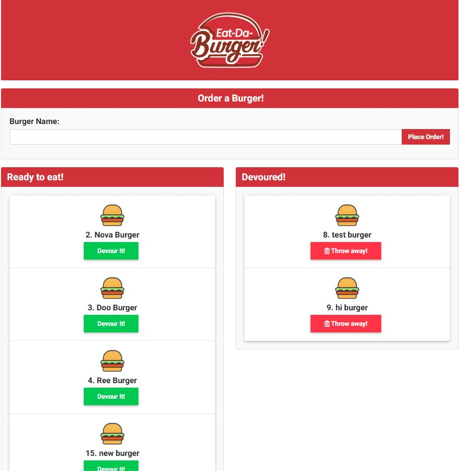
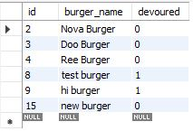

# Eat-Da-Burger

Eat-Da-Burger is a full stack restaurant application created using `Node`, `Express`, `Handlebars`, `MySQL` and a custom `ORM`. It uses the MVC design pattern, Node and MySQL to query and route data to the app and Handlebars to generate the HTML.

Eat-Da-Burger lets users input the names of burgers they'd like to eat. When a user submits a burger's name, the burger is then displayed under the "Ready to Eat" column on the left side of the page with a "Devour it!" button. When the user clicks the devour button, the burger moves to the "Devoured" column on the right side of the page and the devour value for that burger in the database changes to 1(true). The user then has the option to throw away that burger from the Devoured column which deletes the burger from the database completely. Data is persistent!

Click [here]( ) to view the deployed app on Heroku.

## Deployment
1. Clone repo and run `npm install` to download app dependencies.
2. Build database from `burgers_db.sql`
2. Run the app in localhost:8083 in your browser. ("http://localhost:8083")

## Screen Shots

## Technology/Dependencies 
* JavaScript: https://www.javascript.com/
* Node.js: https://nodejs.org/en/
* MySQL Server: https://dev.mysql.com/downloads/mysql
* MySQL Workbench: https://dev.mysql.com/downloads/workbench/
* mysql: https://www.npmjs.com/package/mysql
* Express: https://www.npmjs.com/package/express
* Express-Handlebars: https://www.npmjs.com/package/express-handlebars
* Method-Override: https://www.npmjs.com/package/method-override
* Material Design for Bootstrap (Add CDN in HTML): https://mdbootstrap.com/docs/jquery/
